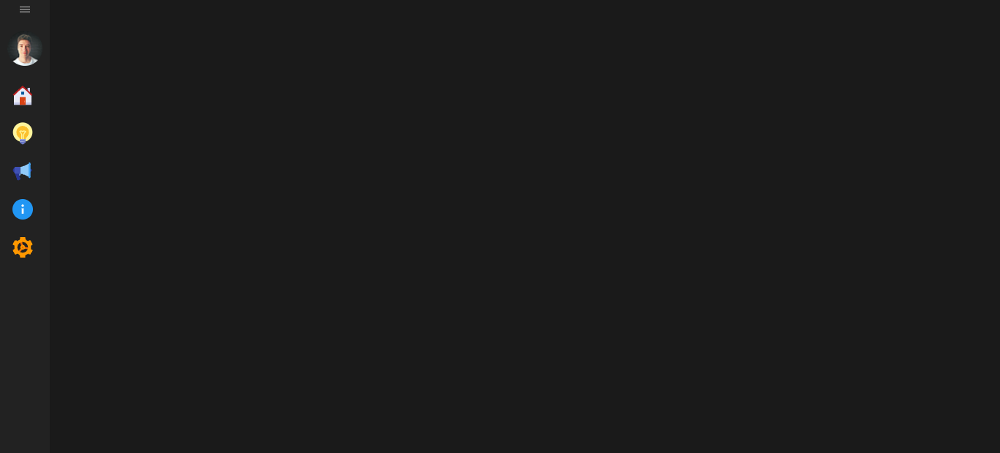
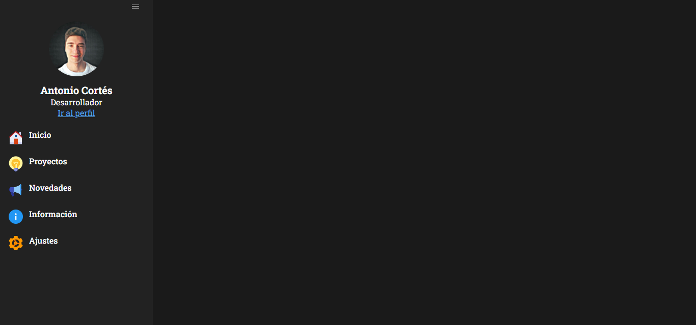

# Vertical Menu in React
 > Vertical menu using TypeScript, React.js and SASS

 ### 🧪 Technologies

  

### 📖 Packages

* react-icons
* scss
* sass

### 📷 View 

#### Collapsed

#### No collapsed

